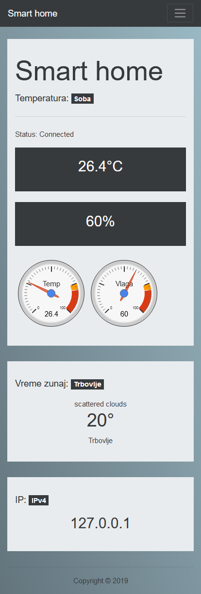

# home-temperature
Simple website for smart home dashboard, displaying data from sensors. 

## Requirements
* Homebridge server with installed plugin for temperature
* MQTT server for receiving sensor data
* Openweathermap portal api key

## Features
* Display temperature and humidity
* Display outdoor temperature using Openweathermap
* Display current public IP
* Background changes according to current sky

## Preview

